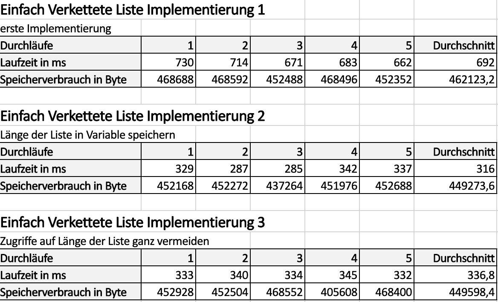

#Übung 1 

### Ziel:

Es soll eine einfach verkettete Liste selbst implementiert werden und dabei dürfen nur
Basisdatentypen und Felder verwendet werden. Danach soll mindestens eine weitere optimierte 
Implementierung erstellt werden. Von allen Implementierungen werden Laufzeit und Speicherverbrauch 
ermittelt und vergleichen, um festzustellen, ob die Optimierung funktioniert hat.

### Optimierungsideen:

#### 1) Länge der Liste in Variable speichern

Die Länge der Liste wird nicht mehr mit einer Hilfmethode `size()` jedes mal neu ermittelt,
sondern in einer Variable `size` innerhalb der Klasse gespeichert und bei jeder Operation,
die Einfluss auf die Länge nimmt, geupdatet. Somit ist die Längejederzeit abrufbar, ohne dass
jedes Mal wieder eine Schleife durchlaufen werden muss. Das sollte die Laufzeit deutlich
verbessern. 

#### 2) Zugriffe auf Länge der Liste ganz vermeiden

Um zu prüfen, ob eine Liste leer ist, wird nicht mehr überprüft, ob die Länge der Liste
Null ist (`size == 0`), sondern ob der Head-Pointer noch nicht existiert (`head == null`). Wenn
noch kein Element in die Liste eingefügt wurde ist dieser nämlich noch `null`. Somit spart man 
sich z.B. bei der `append`- und `prepend`-Methode die Schleife zum Ermitteln der Länge komplett.
Die `get`-Methode kann außerdem auch so umgeschrieben, dass sie die Länge der Liste nicht mehr benötigt.
Somit fällt eine weitere Schleife weg. Die gleiche Herangehensweise kann auch auf einige der anderen
Methoden angewandt werden, sie spielen beim Profiling aber erst einmal keine Rolle, also um die Idee 
zu überprüfen, reicht es zunächst nur die drei bereits gennannten Methoden anzupassen.

### Profilingergebnisse:

 

### Fazit:

Das Reduzieren von Schleifen ist ein guter Optimierungsansatz. Sowohl das Speichern der Länge der 
Liste in einer Variable als auch die Vermeidung der Verwendung führen zu deutlich verbesserter
Laufzeit. Bei Implementierung 2 und 3 hat sich die Laufzeit im Vergleich zu Implementierung 1
fast um die Hälfte verkürzt. Der Speicherverbrauch hat sich dabei zumindest auch etwas verbessert.