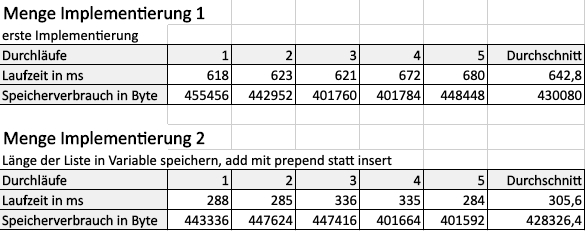

## Übung 2

### Doppelt verkettete Liste

#### Ziel:

Genau wie in Übung 1, soll eine verkettete Liste selbst implementiert werden, dieses Mal aber eine doppelt verkettete. Die Profilingergebnisse sollen mit denen aus Übung 1 verglichen werden.

### Profilingergebnisse:

 

#### Fazit:

Die doppelt verkettete Liste ist deutlich schneller als jede meiner Implementierungen der einfach verketteten Liste und sie verbraucht auch weniger Speicher. 
Zum einen liegt das sicherlich daran, dass beim Profiling das Ausgeben von Ende bis Anfang deutlich schneller geht, da man jetzt nicht mehr jedes Mal einen Zugriff mit der `get`-Methode machen muss, sondern die doppelt verkettete Liste rückwärts durchlaufen kann. 
Außerdem ist auch die `append`-Methode deutlich schneller. Beim Einfügen am Ende bei der einfach verketteten Liste muss jedes Mal die gesamte Liste mit einer Schleife durchlaufen werden, um das letzte Element zu finden. Bei der doppelt verketteten Liste können wir direkt auf das letzte Element zugreifen, was dementsprechend deutlich schneller geht. 
Um das Einfügen in die einfach verkettete Liste schneller zu machen, könnte man statt der `append`-Methode auch einfach die `prepend`-Methode verwenden und somit auch das ständige Durchlaufen der Liste vermeiden, aber auch dann ist die dopppelt Verkettete Liste immer noch schneller.

### Menge

#### Ziel:

Es soll nun basierend auf der einfach oder doppelt verketteten Liste ein Set implementiert werden sowie eine zweite optimierte Implementation davon. Beides soll wieder profiled und verglichen werden.

#### Optimierungsideen:

#### 1) Size des Sets in Variable speichern

Die Anzahl der Elemente, die sich im Set befindet wird nicht mehr mit einer Methode jedes mal neu ermittelt,
sondern in einer Variable `size` innerhalb der Klasse gespeichert und bei jeder Operation,
die Einfluss auf die Länge nimmt, geupdatet. Somit ist die Länge jederzeit abrufbar, ohne dass
jedes Mal wieder eine Schleife durchlaufen werden muss. Das sollte die Laufzeit deutlich
verbessern. 

#### 2) Prepend verwenden statt Insert an Index 0

Beim Einfügen in das Set kann man statt der `insert`-Methode der zu Grunde liegenden Liste die `prepend`- Methode verwenden, 
da diese nicht auf die Länge der Liste zugreift und außerdem weniger if-else-Statements beinhaltet, was die Laufzeit verbessern sollte.

#### Profilingergebnisse:

 

#### Fazit:

Wie zu erwarten war, ist die zweite Implementierung der Menge schneller und verbraucht auch etwas weniger Speicher.
Außerdem sind beide Implementierungen der Menge langsamer als die der doppelt verketteten Liste, auf welcher die Implementierungen
basieren. Das liegt daran, dass beim Einfügen jedes Mal überprüft werden muss, ob ein Element vorhanden ist. Dabei wir eine
Schleife durchlaufen, welche für die längere Laufzeit verantwortlich ist.