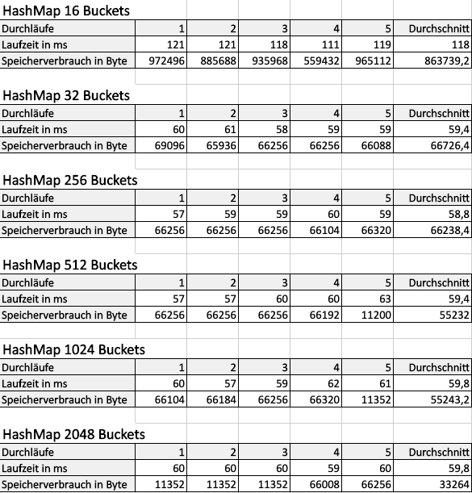

## Übung 3 

### Ziel:

Es soll eine HashMap selbst implementiert und dann die Performance der Implementation getestet werden.

### Implementierung:

Der HashMap liegt ein Array von Key-Value-Paaren zu Grunde. Die Länge des Arrays sind die sogenannten Buckets. 
Die Hash-Funktion basiert darauf, dass der jeweilige Key in ein Char-Array umgewandelt und dann basierend auf 
den ASCII-Werten der jeweiligen Chars aufsummiert wird. Anschließend wird die Summe modulo Anzahl der Buckets gerechnet.
Bei Hash-Collision wird innerhalb des jeweiligen Buckets eine verkettete Liste verwendet. Dadurch können trotzdem alle 
Key-Value-Paare mit dem gleichen Hash gespeichert werden, ohne dass sie sich gegenseitig überschreiben. Außerdem 
ist so möglich, dass mehr Paare gespeichert werden, als es Buckets gibt.

### Profilingergebnisse:

 

Beim Profiling wurde lediglich die Anzahl der Buckets verändert.  

### Fazit:

Der direkte Zugriff per Index (im Falle der HashMap ist das der Hash) auf einen Wert in einem Array ist schneller als
wenn erst eine verkettete Liste durchlaufen werden muss, um den Wert zu finden. Außerdem verbraucht das direkte Speichern
im Array weniger Speicherplatz als die Elemente in einer Liste. 

Daraus folgt: Je weniger Buckets es gibt, desto länger werden die verketteten Listen innerhalb jedes Buckets und somit werden 
Einfügen und Auslesen langsamer und der Speicherverbrauch erhöht sich. Das erklärt die deutlich langsamere Laufzeit bei 16 Buckets.

Daraus folgt außerdem: Je mehr Buckets es gibt, desto kürzer werden die verketteten Listen innerhalb jedes Buckets. Die durchschnittliche
Länge der Listen pro Bucket in unserem Testbeispiel beträgt für 16 Buckets 382 Einträge, für 32 Buckets hingegen schon nur noch 191 und 
bei 256 Buckets nur noch 23 Einträge pro Liste. Das erklärt auf jeden Fall, dass sich der Speicherverbrauch bei mehr Buckets vermindert.

Die Laufzeit wird jedoch nicht besser. Das liegt an der gewählten Hash-Funktion. Diese verteilt die Einträge nicht gleichmäßig auf die Buckets.
Da durch die Anzahl der Buckets geteilt wird, ist bei hoher Bucket-Anzahl schnell der Punkt erreicht, an dem sich die errechnete Integer-Repräsentation
des Keys nicht mehr teilen lässt, da die Anzahl der Buckets deutlich größer ist. Die Listen sind zwar durchschnittlich sehr kurz, da es viele Buckets
mit sehr wenigen Elementen gibt, jedoch sind die Listen bestimmter Buckets (im Testbeispiel um Index 400 herum ab 512 Buckets) immer noch sehr lang.

Deshalb sehen wir nach 256 Buckets keine Laufzeitverbesserung mehr sondern eher eine Verschlechterung. Es gibt jedoch ab 512 Buckets auch keine deutliche
Verschlechterung mehr, da viele Buckets bei höherer Bucket-Anzahl einfach leer bleiben (im Test Beispiel wird die durchschnittliche Listenlänge nie 
kleiner als 9 bzw. die Anzahl der Buckets, die Einträge enthalten, wird nicht größer 677).

Daraus folgt, dass die Performance mit einer anderen Hash-Funktion, die die Einträge auch bei hoher Bucket-Anzahl gleichmäßiger verteilt, vermutlich
verbessert werden könnte. Dadurch könnte die Geschwindigkeit des Arrays im Vergleich zur verketteten Liste besser ausgenutzt werden.